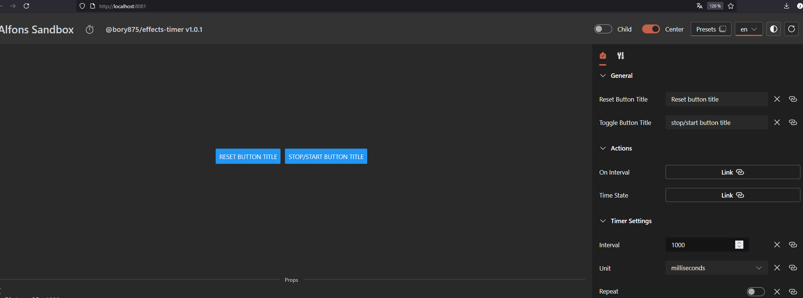

# Timer Effect Plugin

Timer Effect Plugin for Alfons framework enables action execution based on time intervals.

## Features

- ⏰ **Timer**: Configurable interval in milliseconds or seconds
- 🔄 **Repeat**: Option to repeat timer
- ⏸️ **Pause/Resume**: Pause and resume countdown
- 🔄 **Reset**: Restart timer
- 📤 **Time Export**: Remaining time for external components

## Configuration

| Property | Type | Description |
|----------|------|-------------|
| `interval` | number | Time interval (default: 1000) |
| `unit` | enum | Time unit: 'milliseconds' \| 'seconds' |
| `repeat` | boolean | Timer repetition |
| `onInterval` | reference | Action triggered after interval completion |
| `timeState` | reference | Remaining time export (optional) |

## Technical Details

- **Framework**: Alfons PDK, React, TypeScript
- **Localization**: Czech and English translations
- **Testing**: Jest with React Testing Library, comprehensive test coverage
- **Icon**: TimerRegular from Fluent Icons
- **No children**: `shouldAllowChild: () => () => false`

